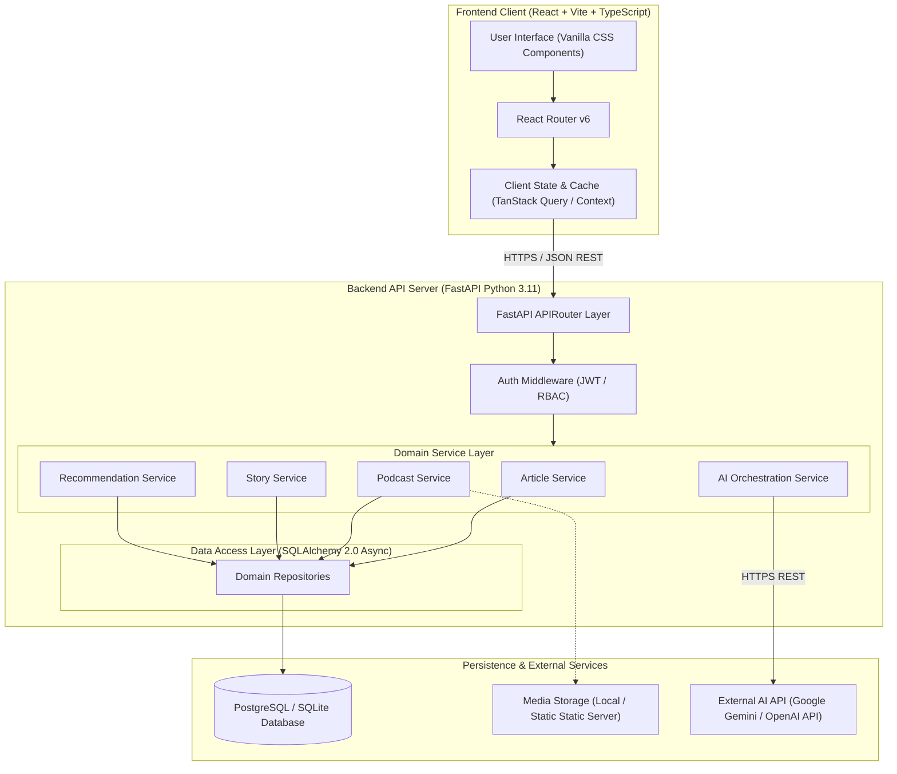

# MindCampus — System Architecture Specification

## 1. High-Level Architecture Overview

MindCampus follows a clean 3-tier modular monolithic architecture. This structure ensures clear separation of concerns, high maintainability, strong security boundaries, and ease of demonstration for academic evaluations.



---

## 2. Layer Responsibilities

### 2.1 Frontend Client Layer (React 18 + Vite + TypeScript)
* **Presentation**: Pure Vanilla CSS design system using CSS variables, flexbox, grid, glassmorphism, and responsive breakpoints.
* **State Management**:
  * **Server State**: Managed via TanStack Query (React Query) for caching, optimistic updates, background fetching, and loading/error state management.
  * **Global UI State**: Lightweight React Context API for user authentication session, active podcast audio player state, and theme settings.
* **Security**: Client sanitizes inputs before display, stores JWT securely in `HTTPOnly` cookie or memory/localStorage fallback, and enforces role-protected client routes.

### 2.2 Backend Service Layer (FastAPI Python 3.11)
* **API Routing**: FastAPI async controllers with strict Pydantic schema validation for request bodies and response DTOs.
* **Authentication & Authorization**: OAuth2 Password Flow with JWT tokens. Dependency injection enforces role checks (`is_student`, `is_admin`).
* **Domain Services**: Encapsulate all business rules (e.g., content publishing constraints, AI prompt assembly, rating calculation, recommendation scoring).
* **Data Access (Repository Pattern)**: Asynchronous SQLAlchemy 2.0 handling entity persistence, transaction management, and complex SQL joins.

### 2.3 Persistence & External Services Layer
* **Relational Database**: PostgreSQL 16 (Production) or SQLite (Local Development) accessed asynchronously.
* **Media Assets**: Podcast audio files and digital story images served via FastAPI static file mount `/static/uploads` or cloud object storage.
* **AI Provider API**: External LLM services (e.g., Google Gemini 1.5 Pro/Flash API or OpenAI GPT-4o-mini API) accessed via an abstract adapter interface `AIServiceInterface`.

---

## 3. Comprehensive Project Directory Structure

```
AI Health Care/
├── .agents/                        # Agent workflows and rules
│   └── rules/
│       └── mindcampus_rules.md     # Project-specific AI agent guidelines
├── AGENTS.md                       # Workspace root agent rules
├── docs/                           # Technical Specifications & Documentation
│   ├── requirements.md             # Functional & non-functional requirements
│   ├── architecture.md             # System architecture blueprint (This file)
│   ├── database_schema.md          # Database tables & ER model
│   ├── api_specification.md        # REST API endpoints & DTOs
│   ├── ai_architecture.md          # AI features & safety guardrails
│   ├── ui_ux_specification.md      # UI components & Design system
│   ├── security.md                 # Threat model & security controls
│   ├── accessibility.md            # WCAG 2.2 AA standards
│   ├── testing_strategy.md         # Unit, integration & E2E plan
│   ├── development_roadmap.md      # 12-Phase roadmap & criteria
│   ├── project_rules.md            # Coding standards & AI rules
│   └── implementation_plan.md      # Phase 1 summary & execution plan
├── frontend/                       # React + Vite Frontend Application
│   ├── public/                     # Static assets (favicons, logos)
│   ├── src/
│   │   ├── assets/                 # SVGs, audio icons, static images
│   │   ├── components/             # Reusable UI Components
│   │   │   ├── common/             # Navbar, Footer, Button, Card, Modal, Toast
│   │   │   ├── articles/           # ArticleCard, ArticleGrid, SummaryBox
│   │   │   ├── podcasts/           # AudioPlayer, EpisodeList, TranscriptView
│   │   │   ├── stories/            # StoryCard, StoryViewer, QuoteBox
│   │   │   ├── ai/                 # AIAssistantModal, MoodSelector, NaturalSearchBar
│   │   │   └── admin/              # AIDraftModal, ContentEditor, AdminTable
│   │   ├── context/                # AuthContext, AudioPlayerContext, ThemeContext
│   │   ├── hooks/                  # Custom hooks (useAuth, usePodcasts, useAI)
│   │   ├── pages/                  # Page Containers
│   │   │   ├── public/             # HomePage, BlogPage, ArticleDetailPage, PodcastPage, StoryPage, AboutPage, SafetyPage
│   │   │   ├── student/            # ProfilePage, BookmarksPage, RecommendedPage
│   │   │   └── admin/              # DashboardPage, ManageArticlesPage, CreateArticlePage, ManageCategoriesPage
│   │   ├── services/               # API Clients (axios/fetch wrappers)
│   │   ├── styles/                 # CSS Design System
│   │   │   ├── main.css            # Base resets & root tokens
│   │   │   ├── typography.css      # Font definitions & scales
│   │   │   ├── components.css      # Button, Card, Modal, Input styles
│   │   │   └── utilities.css       # Layout grids, spacing, animation keyframes
│   │   ├── types/                  # TypeScript interfaces & DTOs
│   │   ├── utils/                  # Helper functions (date formatters, text helpers)
│   │   ├── App.tsx                 # Main application component & routes
│   │   └── main.tsx                # Entry point
│   ├── index.html                  # HTML5 base template with meta tags
│   ├── package.json                # Node dependencies
│   ├── tsconfig.json               # TypeScript strict configuration
│   └── vite.config.ts              # Vite dev server & proxy settings
├── backend/                        # Python FastAPI Backend Application
│   ├── app/
│   │   ├── api/                    # API Route Controllers
│   │   │   ├── v1/
│   │   │   │   ├── auth.py         # Registration & Login endpoints
│   │   │   │   ├── articles.py     # Article CRUD & publishing
│   │   │   │   ├── categories.py   # Category management
│   │   │   │   ├── podcasts.py     # Podcast CRUD & audio metadata
│   │   │   │   ├── stories.py      # Digital story endpoints
│   │   │   │   ├── bookmarks.py    # Bookmark operations
│   │   │   │   └── ai.py           # AI recommendation & assistant endpoints
│   │   │   └── router.py           # V1 Master APIRouter
│   │   ├── core/                   # Core application configuration
│   │   │   ├── config.py           # Settings & Pydantic BaseSettings
│   │   │   ├── database.py         # SQLAlchemy async engine & session maker
│   │   │   ├── security.py         # Password hashing & JWT generation
│   │   │   └── safety.py           # Mental health crisis keyword scanner
│   │   ├── models/                 # SQLAlchemy ORM Data Models
│   │   │   ├── user.py
│   │   │   ├── article.py
│   │   │   ├── podcast.py
│   │   │   ├── story.py
│   │   │   ├── category.py
│   │   │   └── ai_log.py
│   │   ├── schemas/                # Pydantic Request/Response DTOs
│   │   ├── services/               # Business Logic Layer
│   │   │   ├── article_service.py
│   │   │   ├── podcast_service.py
│   │   │   ├── story_service.py
│   │   │   ├── recommendation_service.py
│   │   │   └── ai_service.py       # AI Provider Integration & Prompts
│   │   └── main.py                 # FastAPI application factory & startup
│   ├── requirements.txt            # Python package requirements
│   └── alembic/                    # Database migration scripts
└── tests/                          # Automated Test Suites
    ├── backend/                    # Pytest unit & integration tests
    └── frontend/                   # Vitest & Playwright E2E tests
```

---

## 4. Architectural Decision Records (ADRs)

### ADR-01: Modular Monolith vs. Microservices
* **Decision**: Adopt a Modular Monolith architecture for FastAPI and React.
* **Rationale**: Eliminates network latency between services, simplifies transaction management, drastically reduces deployment complexity, and makes the project straightforward for academic presentation while keeping modules decoupled.

### ADR-02: FastAPI (Python) for Backend Framework
* **Decision**: Select FastAPI over Node.js (Express) or Django.
* **Rationale**: FastAPI provides high-performance asynchronous execution, automatic generation of interactive Swagger/OpenAPI docs, native Pydantic data validation, and seamless integration with Python-based AI and machine learning libraries.

### ADR-03: Vanilla CSS Design System over Tailwind CSS
* **Decision**: Use modern Vanilla CSS with CSS Custom Properties.
* **Rationale**: Gives 100% fine-grained visual control over custom branding, dark/light themes, smooth glassmorphism, and complex animations without requiring heavy build steps or learning extra utility class syntax.

### ADR-04: Hybrid AI Recommendation Strategy
* **Decision**: Combine keyword/category metadata filtering with AI semantic similarity scoring.
* **Rationale**: Pure LLM recommendation calls on every request introduce latency and high API costs. A hybrid approach ensures instantaneous responses via database indexing while reserving AI calls for complex natural language queries.
