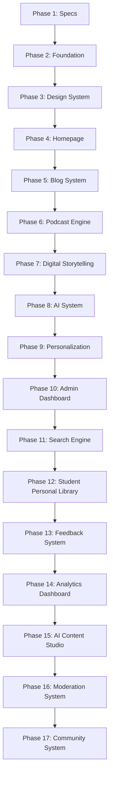

# MindCampus — Phase-by-Phase Development Roadmap

## 1. 17-Phase Milestone Overview

MindCampus follows a structured multi-phase development roadmap. Each phase has explicit dependencies, deliverables, and acceptance criteria to ensure incremental progress without architectural rework.

---

## 2. Detailed Phase Specifications & Completion Criteria

### Phase 1 — Planning, Architecture & Technical Specification (COMPLETED)
* **Goal**: Establish full architectural blueprint, security model, database schema, API contracts, and project rules.

---

### Phase 2 — Project Foundation & Development Environment (COMPLETED)
* **Goal**: Initialize repository structure, package configurations, environment setup, and database migrations.

---

### Phase 3 — Design System & Frontend Foundation (COMPLETED)
* **Goal**: Implement visual aesthetics, typography, CSS tokens, theme switcher, and core UI components.

---

### Phase 4 — Public Homepage & Website Shell (COMPLETED)
* **Goal**: Build landing page layout, mood selector, and hero banners.

---

### Phase 5 — Blog Platform & Database Integration (COMPLETED)
* **Goal**: Build full article listing, filtering, detail pages, and reading experience.

---

### Phase 6 — Podcast Platform & Audio Engine (COMPLETED)
* **Goal**: Build audio podcast library, episode detail view, sticky player, and transcripts.

---

### Phase 7 — Digital Storytelling Platform (COMPLETED)
* **Goal**: Build interactive visual student story gallery and section reader.

---

### Phase 8 — AI-Assisted Student Wellness & Motivation System (COMPLETED)
* **Goal**: Build decoupled AI provider abstraction layer, zero-LLM crisis safety interceptor, non-clinical prompt boundaries, and grounded content recommendations.

---

### Phase 9 — Student Engagement, Personalization & Content Discovery System (COMPLETED)
* **Goal**: Build student resource library, reading/listening progress tracking, topic preferences, and deterministic recommendation engine.

---

### Phase 10 — Admin Content Management & Moderation System (COMPLETED)
* **Goal**: Build administrative portal for managing articles, podcasts, stories, categories, and AI drafts.

---

### Phase 11 — Search, Content Discovery & Advanced Navigation System (COMPLETED)
* **Goal**: Build multi-format search engine, deterministic relevance scoring algorithm, autocomplete suggestions, topic taxonomy directory, related content discovery, and AI query translation.

---

### Phase 12 — Student Engagement, Bookmarks, Saved Library & Content Progress System (COMPLETED)
* **Goal**: Build complete student personal content library system (`/library`), normalized saved bookmarks (`SavedContent`), reading and audio playback progress tracking (`ContentProgress`), completion threshold ($\ge 90\%$), recently viewed history tracking (`RecentlyViewed`), and IDOR-protected REST APIs.

---

### Phase 13 — Student Feedback, Content Rating & Quality Improvement System (COMPLETED)
* **Goal**: Build student helpfulness feedback system (👍 Yes / 👎 No), optional 1-5 star ratings, structured quick feedback tags, written feedback comments with privacy boundaries, operational AI feedback categorization, and administrative content quality dashboard (`/admin/feedback`).

---

### Phase 14 — Admin Analytics & Intelligent Content Insights Dashboard (COMPLETED)
* **Goal**: Build Admin Content Analytics & Intelligent Insights Dashboard (`/admin/analytics`), top-level KPI overview cards (Total Views, Unique Viewers, Saves, Completions, Completion Rate, Helpful Rate, Average Rating), sortable Content Performance Table, Category Breakdown Table, Time-Series Trend Charts, and rule-based Content Improvement Opportunities.

---

### Phase 15 — AI-Assisted Content Intelligence & Content Creation Studio (COMPLETED)
* **Goal**: Build Admin AI Content Creation & Intelligence Studio (`/admin/ai-content`), structured draft generators for Blogs, Podcast scripts, and Digital Stories, side-by-side text revision comparison tool, readability index & sentence complexity analyzer, Phase 14 analytics-informed content opportunity ideas, draft history table, and **Send to CMS Draft** workflow (`publication_status = "draft"`).

---

### Phase 16 — Content Moderation, Safety Review & Human Approval System (COMPLETED)
* **Goal**: Build complete Content Moderation, Safety Review & Human Approval System (`/admin/moderation`), automated safety checks (medical claim scanner, non-clinical boundary check, script sanitization), moderation KPI overview cards, Review Queue table, human decision actions (`approve`, `request_changes`, `reject`, `escalate`), and **Server-Side Publish Protection** (`status == "approved"` required to publish).

---

### Phase 17 — Student Engagement, Comments & Community Interaction System (COMPLETED)
* **Goal**: Build safe, moderated Student Community Interaction System around published content (`article`, `podcast`, `story`), 2-level reply threading limit, single Helpful reaction toggle, IDOR-protected comment edit/delete, community reporting for comments/content (`/admin/community/reports`), and concise Community Guidelines banner.
* **Deliverables**:
  * `Comment`, `CommentHelpful`, `CommunityReport` ORM models, `CommunityService`, `community.py` & `community_admin.py` REST APIs, `community_engagement.md`, `community_guidelines.md`.
  * Frontend components: `<CommentSection />`, `communityService.ts`.
  * Pytest community test suite (`test_community_api.py`), Vitest component tests (`CommentSection.test.tsx`).
* **Acceptance Criteria**: Comments restricted strictly to published content, 2-level max reply depth enforced, IDOR edit/delete verified (User A editing User B fails 403), reporter identity strictly hidden, zero student leaderboards or social-media popularity ranking, 100% test pass rate across 63 Pytest backend tests and 28 Vitest frontend tests.
